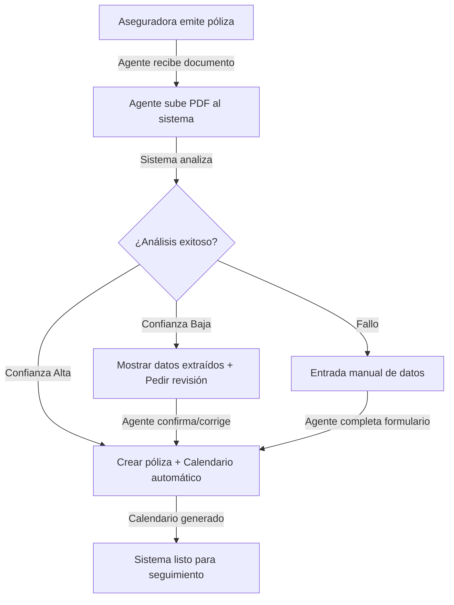
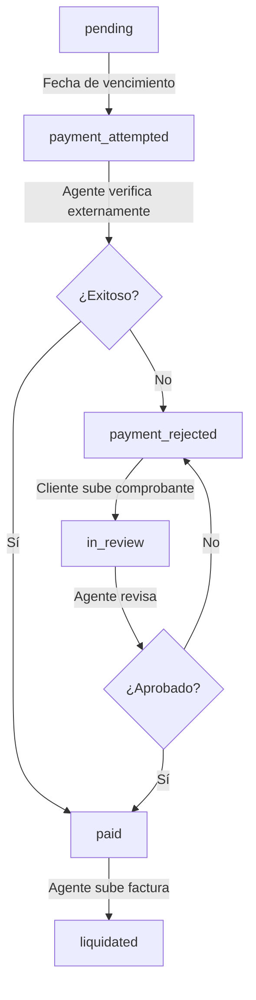
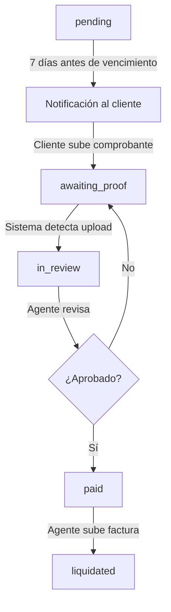
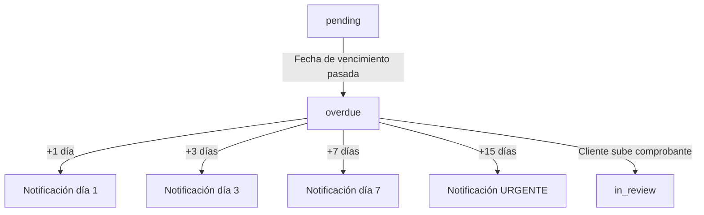

# Sistema de Seguimiento de Pagos de Pólizas
## Optimizado para GoDaddy Shared Hosting

## 📋 Tabla de Contenidos
1. [Instalación de Base de Datos](#instalación-de-base-de-datos)
2. [Configuración de Archivos](#configuración-de-archivos)
3. [Configuración de Cron Jobs](#configuración-de-cron-jobs)
4. [Estructura de Archivos](#estructura-de-archivos)
5. [API Endpoints](#api-endpoints)
6. [Flujos de Trabajo](#flujos-de-trabajo)

---

## 🗄️ Instalación de Base de Datos

### Paso 1: Acceder a phpMyAdmin en cPanel

1. Ingresar a tu cPanel de GoDaddy
2. Buscar "phpMyAdmin" en la barra de búsqueda
3. Seleccionar tu base de datos

### Paso 2: Ejecutar Script SQL

1. Ir a la pestaña "SQL"
2. Copiar el contenido completo de `backend/payments-schema.sql`
3. Pegar en el área de texto
4. Click en "Continuar" o "Go"

**El script creará:**
- 6 tablas nuevas (payment_schedules, payment_proofs, policy_comments, payment_notifications, insurer_invoices, payment_audit_log)
- 4 stored procedures (sp_generate_payment_schedule, sp_get_upcoming_due_payments, sp_get_overdue_payments, sp_get_pending_proof_reviews)

### Paso 3: Verificar Instalación

```sql
-- Ejecutar en phpMyAdmin para verificar
SHOW TABLES LIKE 'payment%';
SHOW PROCEDURE STATUS WHERE Db = 'tu_base_de_datos';
```

Deberías ver 6 tablas y 4 stored procedures.

---

## 📁 Configuración de Archivos

### Paso 1: Crear Directorios de Uploads

Vía SSH o File Manager en cPanel:

```bash
cd /home/tu_usuario/public_html
mkdir -p uploads/proofs
mkdir -p uploads/invoices
chmod 755 uploads
chmod 755 uploads/proofs
chmod 755 uploads/invoices
```

### Paso 2: Proteger Directorios

Crear archivo `.htaccess` en `/uploads/proofs/`:

```apache
# Denegar acceso directo
Require all denied
```

Crear archivo `.htaccess` en `/uploads/invoices/`:

```apache
# Denegar acceso directo
Require all denied
```

**Importante:** Los archivos solo serán accesibles vía `payment-api.php/download-file` que valida permisos.

### Paso 3: Actualizar config.php

Editar `backend/config.php` y agregar:

```php
// Configuración de pagos
define('UPLOAD_BASE_DIR', __DIR__ . '/../uploads/');
define('MAX_FILE_SIZE', 5 * 1024 * 1024); // 5MB
define('ALLOWED_FILE_TYPES', ['pdf', 'jpg', 'jpeg', 'png']);
```

---

## ⏰ Configuración de Cron Jobs

### Acceder a Cron Jobs en cPanel

1. Ingresar a cPanel
2. Buscar "Cron Jobs" en la barra de búsqueda
3. Click en "Cron Jobs"

### Configurar Tarea Diaria

**Configuración recomendada: Ejecutar diariamente a las 9:00 AM**

```
Minuto: 0
Hora: 9
Día: *
Mes: *
Día de la semana: *
Comando: /usr/bin/php /home/TU_USUARIO/public_html/backend/payment-cron.php
```

Reemplazar `TU_USUARIO` con tu nombre de usuario de cPanel.

### Probar Cron Manualmente

Vía SSH:

```bash
php /home/tu_usuario/public_html/backend/payment-cron.php
```

O desde navegador (en desarrollo):

```
https://tu-dominio.com/backend/payment-cron.php?cron_key=your_secret_key
```

**Importante:** Cambiar la clave secreta en producción (variable `$validKey` en payment-cron.php).

### Ver Logs de Cron

Los cron jobs de cPanel registran su ejecución en:
- Email configurado en cPanel (recibirás los echo del script)
- Logs de PHP: `/home/tu_usuario/public_html/php_error_log`

---

## 📂 Estructura de Archivos

```
backend/
├── payments-schema.sql          # Script de creación de BD (ejecutar una vez)
├── payment-service.php          # Lógica de negocio del sistema
├── payment-api.php              # Endpoints REST para frontend
├── payment-cron.php             # Tarea automatizada (notificaciones)
└── config.php                   # Configuración (actualizar)

uploads/                         # Archivos subidos (crear manualmente)
├── proofs/                      # Comprobantes de clientes
│   ├── .htaccess               # Protección
│   └── proof_*.pdf/jpg/png
└── invoices/                    # Facturas de aseguradoras
    ├── .htaccess               # Protección
    └── invoice_*.pdf
```

---

## 🔌 API Endpoints

### Autenticación

Todos los endpoints requieren autenticación vía sesión o JWT.

### Endpoints Cliente

#### 1. Obtener Calendario de Pagos
```http
GET /backend/payment-api.php/get-schedule/{policy_id}
Authorization: Bearer {token}
```

**Respuesta:**
```json
{
  "success": true,
  "schedules": [
    {
      "schedule_id": 1,
      "policy_id": 123,
      "installment_number": 1,
      "due_date": "2024-02-01",
      "amount_due": 500.00,
      "status": "pending",
      "payment_method": "transferencia",
      "proof_count": 0,
      "comment_count": 0
    }
  ]
}
```

#### 2. Subir Comprobante de Pago
```http
POST /backend/payment-api.php/upload-proof
Content-Type: multipart/form-data
Authorization: Bearer {token}

{
  "schedule_id": 1,
  "policy_id": 123,
  "proof_file": [archivo PDF/JPG/PNG, máx 5MB]
}
```

**Respuesta:**
```json
{
  "success": true,
  "proof_id": 45,
  "message": "Comprobante subido correctamente. Tu agente lo revisará pronto."
}
```

#### 3. Obtener Notificaciones
```http
GET /backend/payment-api.php/get-notifications?limit=20
Authorization: Bearer {token}
```

**Respuesta:**
```json
{
  "success": true,
  "notifications": [
    {
      "notification_id": 1,
      "notification_type": "due_date_reminder",
      "sent_at": "2024-01-25 09:00:00",
      "due_date": "2024-02-01",
      "amount_due": 500.00,
      "policy_number": "POL-2024-001",
      "notification_data": "{\"message\": \"Tu pago vence pronto\"}"
    }
  ]
}
```

#### 4. Descargar Archivo
```http
GET /backend/payment-api.php/download-file/{type}/{id}
Authorization: Bearer {token}

type: 'proof' | 'invoice'
id: proof_id o invoice_id
```

**Respuesta:** Archivo binario (PDF/JPG/PNG)

---

### Endpoints Agente

#### 1. Subir Documento de Póliza (PRINCIPAL)
```http
POST /backend/payment-api.php/upload-policy
Content-Type: multipart/form-data
Authorization: Bearer {token}

{
  "client_id": 123,
  "policy_file": [archivo PDF/JPG/PNG de la póliza]
}
```

**Respuesta (Éxito - Confianza Alta):**
```json
{
  "success": true,
  "policy_id": 456,
  "data": {
    "policy_number": "POL-2024-001",
    "insurer_name": "GNP",
    "client_name": "Juan Pérez",
    "start_date": "2024-01-01",
    "end_date": "2025-01-01",
    "total_premium": 6000.00,
    "payment_frequency": 12
  },
  "confidence": "high",
  "message": "Póliza procesada y calendario generado correctamente"
}
```

**Respuesta (Requiere Revisión - Confianza Baja):**
```json
{
  "success": true,
  "requires_review": true,
  "data": {
    "policy_number": "POL-2024-001",
    "insurer_name": null,
    "total_premium": 6000.00,
    "payment_frequency": null,
    "start_date": null
  },
  "confidence": "low",
  "message": "Datos extraídos con baja confianza. Por favor revisa y confirma."
}
```

**Respuesta (Fallo en Análisis):**
```json
{
  "success": false,
  "manual_entry": true,
  "error": "No se pudo extraer texto del PDF. Por favor ingresa los datos manualmente."
}
```

**¿Qué hace este endpoint?**
1. Recibe el documento de póliza (PDF preferido)
2. Extrae automáticamente usando patrones de texto:
   - Número de póliza
   - Aseguradora
   - Prima total
   - Frecuencia de pago
   - Fechas de vigencia
3. Crea/actualiza el registro de póliza en BD
4. Genera automáticamente el calendario de pagos
5. Retorna nivel de confianza (high/medium/low)

**Nota:** Como broker, ustedes no crean las pólizas - solo las suben. El sistema extrae los datos automáticamente.

#### 2. Generar Calendario Manualmente (FALLBACK)
```http
POST /backend/payment-api.php/generate-schedule
Content-Type: application/json
Authorization: Bearer {token}

{
  "policy_id": 123,
  "total_premium": 6000.00,
  "payment_frequency": 12,  // 1=anual, 2=semestral, 4=trimestral, 12=mensual
  "start_date": "2024-01-01"
}
```

**Uso:** Solo cuando el análisis automático falla o no está disponible.

#### 3. Obtener Comprobantes Pendientes de Revisión
```http
GET /backend/payment-api.php/get-pending-reviews
Authorization: Bearer {token}
```

**Respuesta:**
```json
{
  "success": true,
  "proofs": [
    {
      "proof_id": 45,
      "policy_number": "POL-2024-001",
      "client_name": "Juan Pérez",
      "upload_date": "2024-01-20 14:30:00",
      "file_name": "proof_123_1_20240120143000.pdf",
      "amount_due": 500.00,
      "due_date": "2024-02-01"
    }
  ]
}
```

#### 3. Revisar Comprobante
```http
POST /backend/payment-api.php/review-proof
Content-Type: application/json
Authorization: Bearer {token}

{
  "proof_id": 45,
  "approved": true,  // true = aprobar, false = rechazar
  "notes": "Comprobante válido. Proceder con factura."
}
```

**Respuesta:**
```json
{
  "success": true,
  "message": "Comprobante aprobado"
}
```

#### 4. Subir Factura de Aseguradora
```http
POST /backend/payment-api.php/upload-invoice
Content-Type: multipart/form-data
Authorization: Bearer {token}

{
  "schedule_id": 1,
  "policy_id": 123,
  "invoice_number": "INV-ASG-2024-001",
  "invoice_file": [archivo PDF]
}
```

**Respuesta:**
```json
{
  "success": true,
  "invoice_id": 78,
  "message": "Factura registrada correctamente"
}
```

#### 5. Actualizar Estado de Pago
```http
POST /backend/payment-api.php/update-status
Content-Type: application/json
Authorization: Bearer {token}

{
  "schedule_id": 1,
  "status": "payment_rejected",  // Ver estados válidos abajo
  "notes": "Cargo rechazado por fondos insuficientes"
}
```

**Estados válidos:**
- `pending` - Pendiente
- `payment_attempted` - Intento de cargo automático
- `payment_rejected` - Cargo rechazado
- `awaiting_proof` - Esperando comprobante del cliente
- `in_review` - Comprobante en revisión
- `paid` - Pagado (esperando factura)
- `liquidated` - Liquidado (factura enviada)

---

## 🔄 Flujos de Trabajo

### Flujo 0: Ingreso de Póliza (NUEVO - Como Broker)



**Proceso:**
1. **Aseguradora emite póliza**: Cliente contrata con aseguradora (no con broker)
2. **Agente recibe documento**: PDF de la póliza emitida
3. **Upload al sistema**: Agente sube PDF vía interfaz
4. **Análisis automático**: Sistema extrae:
   - Número de póliza
   - Aseguradora (GNP, AXA, Mapfre, etc.)
   - Prima total
   - Frecuencia de pago
   - Fechas de vigencia
5. **Confianza alta (75%+)**: Crear póliza + generar calendario automáticamente
6. **Confianza media/baja**: Mostrar datos extraídos para revisión manual
7. **Fallo en extracción**: Formulario manual disponible
8. **Calendario generado**: Sistema comienza seguimiento automático

### Flujo 1: Pago Mensual (Domiciliación)



**Proceso:**
1. **pending**: Sistema espera fecha de vencimiento
2. **payment_attempted**: Cron cambia estado automáticamente el día de vencimiento
3. Agente verifica externamente si el cargo fue exitoso
4. **Si exitoso**: Agente actualiza a "paid" manualmente
5. **Si rechazado**: Agente actualiza a "payment_rejected" y notifica cliente
6. Cliente sube comprobante de pago manual
7. **in_review**: Agente revisa comprobante
8. **paid**: Agente espera factura de aseguradora
9. **liquidated**: Agente sube factura y cierra pago

### Flujo 2: Pago Trimestral/Semestral (Manual)



**Proceso:**
1. **pending**: Sistema espera 7 días antes de vencimiento
2. Cron envía notificación al cliente (recordatorio)
3. Cliente sube comprobante de pago
4. **in_review**: Sistema notifica al agente
5. Agente revisa y aprueba/rechaza
6. **paid**: Agente espera factura de aseguradora
7. **liquidated**: Agente sube factura y cierra pago

### Flujo 3: Pago Vencido



**Proceso:**
1. Cron detecta pagos vencidos diariamente
2. Envía notificaciones escaladas:
   - Día 1: Recordatorio suave
   - Día 3: Recordatorio importante
   - Día 7: Recordatorio urgente
   - Día 15: Notificación crítica
3. Cliente sube comprobante cuando pueda
4. Flujo continúa normalmente desde "in_review"

---

## 🔐 Seguridad

### Validaciones Implementadas

1. **Autenticación**: Todos los endpoints requieren sesión válida
2. **Autorización**: Clientes solo acceden a sus propias pólizas
3. **Validación de archivos**:
   - Tamaño máximo: 5MB
   - Tipos permitidos: PDF, JPG, PNG
   - Verificación de MIME type real (no solo extensión)
4. **Protección de directorios**: `.htaccess` niega acceso directo
5. **Descarga segura**: Validación de permisos antes de servir archivo
6. **SQL Injection**: Prepared statements en todas las queries
7. **XSS**: Sanitización de inputs en frontend
8. **Auditoría**: Todos los cambios registrados con IP y user agent

---

## 📊 Monitoreo y Mantenimiento

### Logs a Revisar

1. **PHP Error Log**: `/home/tu_usuario/public_html/php_error_log`
2. **Cron Email**: Revisa el email configurado en cPanel
3. **Audit Log**: Consultar tabla `payment_audit_log` en BD

### Queries Útiles para Monitoreo

```sql
-- Comprobantes pendientes de revisión
SELECT COUNT(*) FROM payment_proofs WHERE status = 'pending_review';

-- Pagos vencidos
SELECT COUNT(*) FROM payment_schedules 
WHERE status = 'pending' AND due_date < CURDATE();

-- Actividad reciente (últimas 24 horas)
SELECT * FROM payment_audit_log 
WHERE action_date > DATE_SUB(NOW(), INTERVAL 24 HOUR)
ORDER BY action_date DESC;

-- Notificaciones enviadas hoy
SELECT notification_type, COUNT(*) as total
FROM payment_notifications
WHERE DATE(sent_at) = CURDATE()
GROUP BY notification_type;
```

### Limpieza de Datos

```sql
-- Eliminar notificaciones antiguas (más de 90 días)
DELETE FROM payment_notifications 
WHERE sent_at < DATE_SUB(NOW(), INTERVAL 90 DAY);

-- Eliminar logs de auditoría antiguos (más de 1 año)
DELETE FROM payment_audit_log 
WHERE action_date < DATE_SUB(NOW(), INTERVAL 1 YEAR);
```

---

## 🐛 Troubleshooting

### Problema: Cron no se ejecuta

**Solución:**
1. Verificar ruta del comando: `which php` en SSH
2. Revisar permisos del archivo: `chmod 644 payment-cron.php`
3. Verificar sintaxis PHP: `php -l payment-cron.php`
4. Revisar email de cPanel para errores

### Problema: No se suben archivos

**Solución:**
1. Verificar permisos de directorios: `chmod 755 uploads/*`
2. Revisar `php.ini`:
   ```ini
   upload_max_filesize = 10M
   post_max_size = 10M
   ```
3. Verificar espacio en disco: `df -h`

### Problema: Stored procedures no funcionan

**Solución:**
1. Verificar creación: `SHOW PROCEDURE STATUS WHERE Db = 'tu_db';`
2. Verificar permisos: El usuario de BD debe tener privilegio `EXECUTE`
3. Re-ejecutar script de creación en phpMyAdmin

---

## 📞 Soporte

Para dudas o problemas, revisar:
1. Logs de PHP (`php_error_log`)
2. Tabla `payment_audit_log` para trazabilidad
3. Emails del cron job para errores de ejecución

---

## 🎯 Próximos Pasos (Opcional)

- [ ] Integración de email service (SendGrid/SMTP)
- [ ] Integración de WhatsApp (Twilio)
- [ ] Dashboard de agente para revisión de comprobantes
- [ ] Interfaz de cliente para subir comprobantes
- [ ] Reportes de comisiones (futuro)
